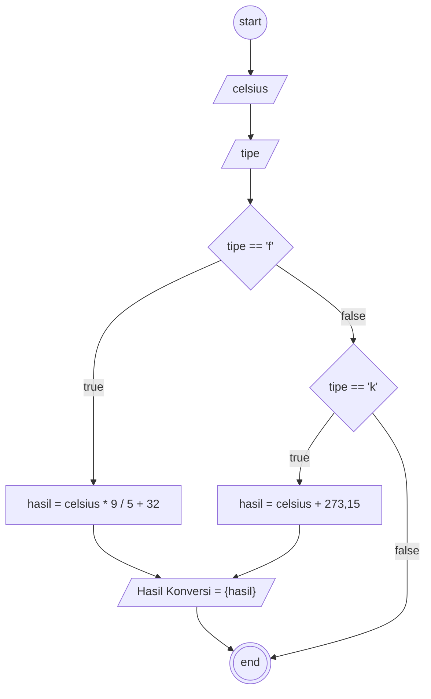

# Algortima

Konversi Suhu Celsius

## Deskripsi

1. Mulai
2. Masukan Suhu Sebagai Celsius
3. Masukan Type Sebagai tipe
4. Jika tipe sama dengan 'f' maka akan mengkonversi Farenheit, Celsius dikali 9 / 5 di tambah 32 dan akan di simpan di hasil
5. Jika tipe sama dengan 'k' maka suhu mengkonversi Kelvin,Celsius ditambah 273,15 dan disimpan sebagai hasil
6. Outputkan hasil
7. Selesai

## Flowchart



## Pseudocode

```pseudo
DECLARE celsius: INTEGER
DECLARE hasil: DOUBLE
DECLARE tipe: CHAR
INPUT celsius
INPUT tipe

IF tipe == 'f' THEN
  hasil <- celsius * 9 / 5 + 32
ELSEIF tipe == 'k' THEN
  hasil <- celsius + 273,15
ENDIF

OUTPUT "Hasil Konversi = ", hasil
```
