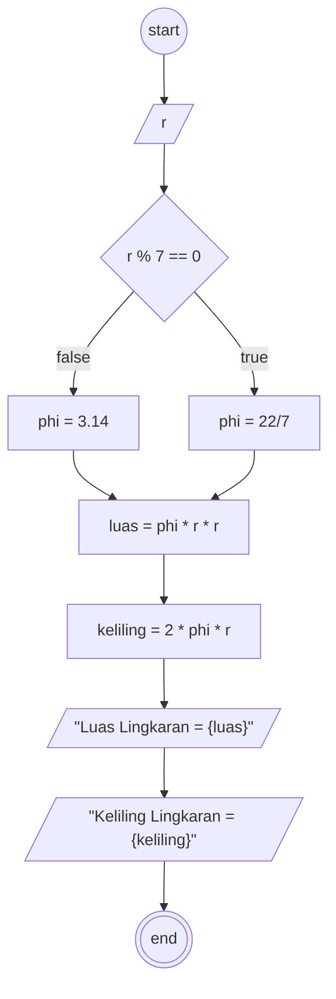

# Algortima

Luas dan keliling lingkaran

## Deskripsi

1. Mulai
2. Masukan angka sebagai jari-jari (r)
3. Jika jari-jari (r) habis dibagi 7, maka phi = 22/7, jika tidak maka phi = 3.14
4. Hitung luas phi dikalikan dengan jari-jari (r) kuadrat
5. Hitung keliling phi dikaliakan 2 dan dikalikan lagi dengan jari-jari (r)
6. Selesai

## Flowchart



## Pseudocode

```pseudo
DECLARE r: INTEGER
DECLARE phi: DOUBLE
DECLARE luas: DOUBLE
DECLARE keliling: DOUBLE

INPUT r

IF r % 7 == 0 THEN
  phi <- 22 / 7
ELSE
  phi <- 3.14
ENDIF

luas <- phi * r * r
keliling <- 2 * phi * r

OUTPUT "Luas Lingkaran = ", luas
OUTPUT "Keliling Lingkaran = ", keliling
```
