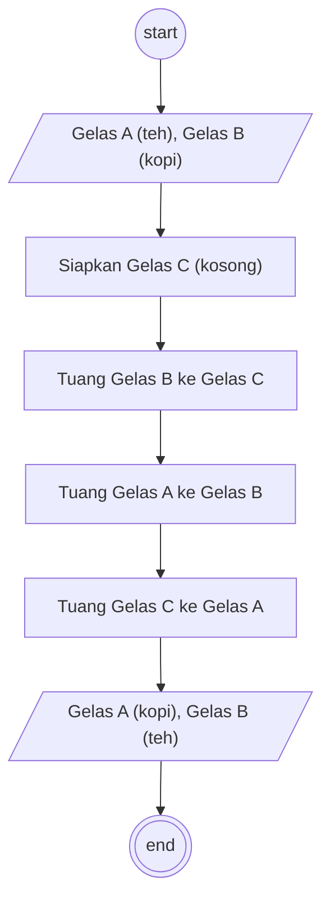

# Algortima

Memindahakan isi di dalam gelas

## Deskripsi

1. Mulai
2. Ada gelas A berisi teh dan gelas B berisi kopi
3. Siapkan gelas C yang kosong
4. Tuangkan gelas B yang berisi kopi kedalam gelas C yang kosong
5. Tuangkan gelas A yang berisi teh kedalam gelas B yang sudah kosong
6. Tuangkan gelas C yang di berisi kopi kedalam gelas A yang sekarang kosong
7. Sekarang gelas A berisi kopi dan kelas B berisi teh
8. Selesai

## Flowchart



## Pseudocode

```pseudo
DECLARE gelas_a: STRING
DECLARE gelas_b: STRING
DECLARE gelas_c: STRING

gelas_a <- "teh"
gelas_b <- "kopi"
gelas_c <- ""

gelas_c <- gelas_b
gelas_b <- ""

gelas_b <- gelas_a
gelas_a <- ""

gelas_a <- gelas_c
gelas_c <- ""

OUTPUT "Gelas A = ", gelas_a
OUTPUT "Gelas B = ", gelas_b
```
